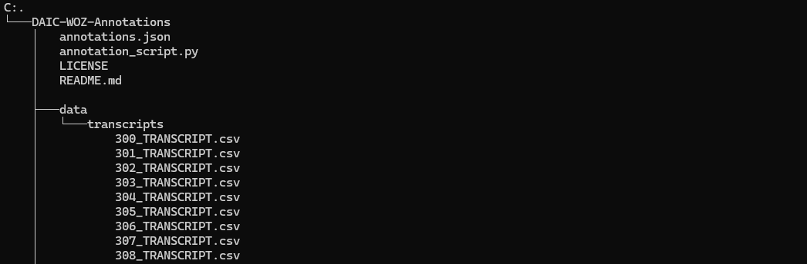

# Analyzing Symptom-based Depression Level Estimation through the Prism of Psychiatric Expertise
Navneet Agarwal<sup>1</sup>, Kirill Milintsevich<sup>1,2</sup>, Lucie Metivier<sup>3</sup>, Maud Rotharmel<sup>4</sup>, Gaël Dias<sup>1</sup>, Sonia Dollfus<sup>5</sup>

<sup>1</sup>Normandie Univ, UNICAEN, ENSICAEN, CNRS, GREYC, 14000 Caen, France.\
<sup>2</sup> Institute of Computer Science, University of Tartu, Tartu, Estonia.\
<sup>3</sup> Normandie Univ, UNICAEN, PhIND, UMR-S 1237, GIP CYCERON, 14000 Caen, France.\
<sup>4</sup> Service hospitalo-universitaire de psychiatrie de l'adulte, Centre Thérapeutique d'Excellence,\\ Centre Hospitalier du Rouvray, Sotteville-les-Rouen, France.\
<sup>5</sup> CHU de Caen, Service de Psychiatrie; Normandie Univ, UNICAEN, ISTS, GIP Cyceron; Normandie Univ, UNICAEN, UFR de Médecine,fédération hospitalo-universitaire-FHU A2M2P,14000 Caen, France.

## Citation
If you are using these annotations in your research, please cite the following work:

```json
@inproceedings{agarwal-etal-2024-analyzing,
    title = "Analyzing Symptom-based Depression Level Estimation through the Prism of Psychiatric Expertise",
    author = {Agarwal, Navneet  and
      Milintsevich, Kirill  and
      Metivier, Lucie  and
      Rotharmel, Maud  and
      Dias, Ga{\"e}l  and
      Dollfus, Sonia},
    editor = "Calzolari, Nicoletta  and
      Kan, Min-Yen  and
      Hoste, Veronique  and
      Lenci, Alessandro  and
      Sakti, Sakriani  and
      Xue, Nianwen",
    booktitle = "Proceedings of the 2024 Joint International Conference on Computational Linguistics, Language Resources and Evaluation (LREC-COLING 2024)",
    month = may,
    year = "2024",
    address = "Torino, Italia",
    publisher = "ELRA and ICCL",
    url = "https://aclanthology.org/2024.lrec-main.87",
    pages = "974--983"
}
```

[Agarwal, N., Milintsevich, K., Métivier, L., Rotharmel, M., Dias, G., $\&$ Dollfus, S. Analyzing Symptom-based Depression Level Estimation through the Prism of Psychiatric Expertise. Joint International Conference on Computational Linguistics, Language Resources and Evaluation (LREC-COLING) 2024. Torino, Italia.](https://aclanthology.org/2024.lrec-main.87/)

## Usage

1. Gain access to the DAIC-WOZ dataset from their official webpage: https://dcapswoz.ict.usc.edu/ and extract all the transcripts
2. Clone this repository
3. Place the extracted DAIC-WOZ transcripts in the "./data/transcripts" folder of this repository. The annotation script assumes the following directory structure



4. Run "annotation_script.py"
5. Annotated transcripts will be placed in the "./data/Annotated_transcripts" folder


## Abstract
The ever-growing number of people suffering from mental distress has motivated significant research initiatives towards automated depression estimation. Despite the multidisciplinary nature of the task, very few of these approaches include medical professionals in their research process, thus ignoring a vital source of domain knowledge. In this paper, we propose to bring the domain experts back into the loop and incorporate their knowledge within the gold-standard DAIC-WOZ dataset. In particular, we define a novel transformer-based architecture and analyze its performance in light of our expert annotations. Overall findings demonstrate a strong correlation between the psychological tendencies of medical professionals and the behavior of the proposed model, which additionally provides new state-of-the-art results.

## DAIC-WOZ Dataset
Access to the DAIC-WOZ dataset can be requested from the official webpage: https://dcapswoz.ict.usc.edu/

## Psychiatrist Annotations
In our attempt to reintroduce domain expertise into the learning process, we carried out the clinical annotation of the DAIC-WOZ dataset. We employed mental health professionals for the annotation process. In particular, three psychiatrists from public hospitals were employed to undertake two major tasks:

### 1. Span-based Annotation
This task consists of highlighting information within transcripts that influences a psychiatrist's decision during an interview. Since it is a subjective task that lacks a definitive right or wrong answer, a common consensus on the importance of various utterances within the transcripts does not exist. Within our annotations process we forgo defining detailed annotation protocols and rely on the annotator's judgment as experts in the field for the reliability of their annotations. However, they were encouraged not only to identify information that suggests the presence of depression, but also to pinpoint clues that indicate its absence. Unfortunately, at this stage of our research, only one annotator per transcript could be assigned due to the workload experienced by the annotators, particularly due to the radical increase of mental care demand after the covid pandemic coupled with the shortage of mental health professionals. The current annotation process lasted nearly 5 months and we anticipate this time frame to scale linearly with the increase in the number of annotators per transcript.

| **Span Level**    | **Non-Depressed class** | **Depressed Class** |
|-------------------|:-----------------------:|:-------------------:|
| Word              | 467(3.53)               | 227(3.98)           |
| Phrase            | 4101(31.06)             | 1913(33.56)         |
| Sentence          | 0                       | 0                   |
| Multi-sentence    | 77(0.58)                | 42(0.73)            |
|**Total**          |4645(35.18)              |2182 (38.28)         |

Table 1: Number of annotations for different levels of annotation spans. Figures in bracket indicate the average number of annotations per transcript

### 2. PHQ-8 scoring
This task involves completing the self-assessment PHQ-8 questionnaire on behalf of each patient only based on their interview transcripts. Although the PHQ-8 screening tool is widely used as a measure of depression, it relies on the subjective assessment of the patient about his/her condition outside the context of the interview. As such, an interview transcript might not contain enough information to accurately express the intensity of individual symptoms. Furthermore, since the interviews are conducted with the aim of depression estimation and not specifically for fulfilling the PHQ-8 questionnaire, information on some symptoms might be missing altogether within individual transcripts depending on the questions asked during the interview. In order to verify these propositions, we asked the clinicians to fulfill the PHQ-8 questionnaires on behalf of each patient based on their understanding of the given transcripts.

| **Symptoms** | No interest | Depressed | Sleep | Tired | Appetite | Failure | Concentration | Movement |
|--------------|:-----------:|:-----------:|:-----------:|:-----------:|:-----------:|:-----------:|:-----------:|:-----------:|
| **# Transcripts** | 178 | 188 | 179 | 160 | 47 | 176 | 48 | 10 |

<!-- ## Neural Network Architecture
To learn the 8 symptom values of the PHQ-8, we design a transformer-based hierarchical model illustrated in Figure below. The architecture is based on the model defined by [Milintsevich et al. (2023)](https://link.springer.com/article/10.1186/s40708-023-00185-9), which has been updated to have access to sentence-level attention and take advantage of recent sentence representation models. In particular, the architecture has undergone two significant alterations: (1) the BiLSTM cells are replaced by a transformer-based encoder at the interview level (interview encoder), and (2) the pre-trained turn encoder is based on the [all-mpnet-base model](https://huggingface.co/sentence-transformers/all-mpnet-base-v2) in place of [S-RoBERTa](https://huggingface.co/sentence-transformers/all-distilroberta-v1), both using a contrastive learning objective.

<p align="center">
  
</p> -->

<!-- ## Attention and Annotated Spans
Psychiatrist annotations highlight text spans that hold relevance for depression estimation as per clinicians' knowledge and medical guidelines. Within this work, psychiatric annotations are analyzed against sentence level attention scores received from the neural network model, sentence being the atomic textual element for the analysis. In particular, we have focused on three different sentence types within the documents: questions (Q), annotated answers (A), and non-annotated answers (N). Transcript-level analysis (based on attention heatmaps) show a strong correlation between clinical annotations and sentence level attention scores. A corpus-level trend is further verified by calculating averages across the entire dataset (Table 3).

<p align="center">
  
</p>

<p align="center">
  
</p> -->